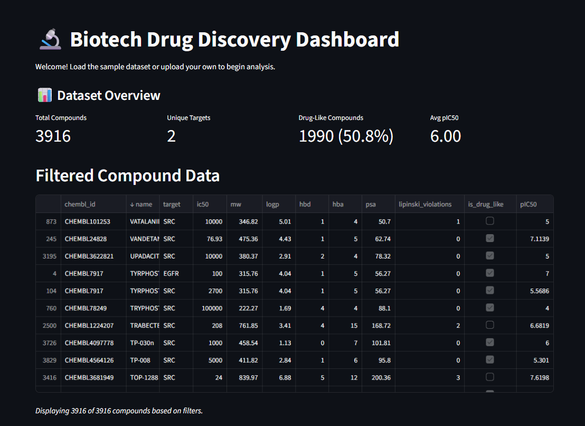
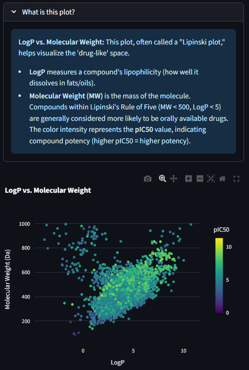
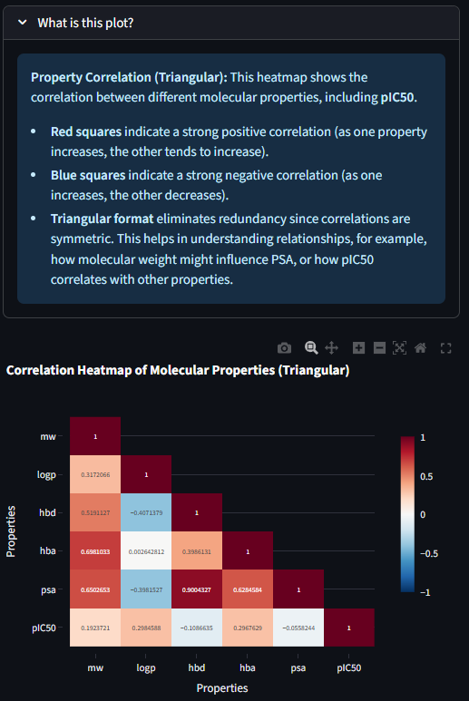
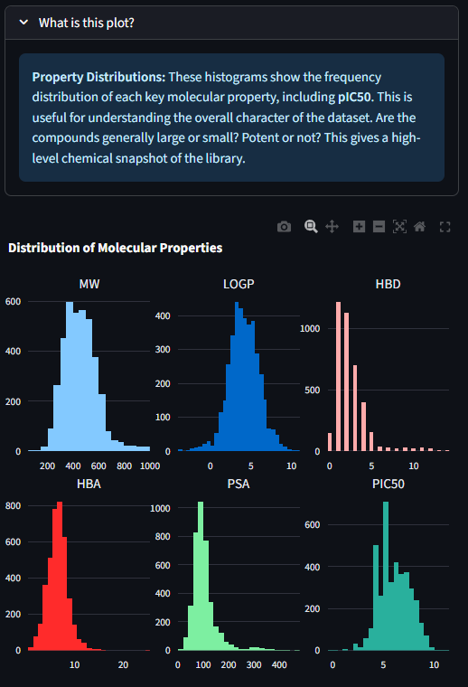
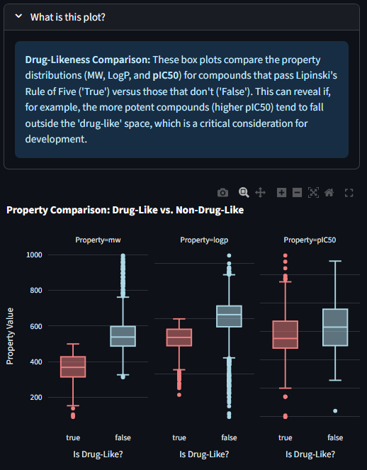
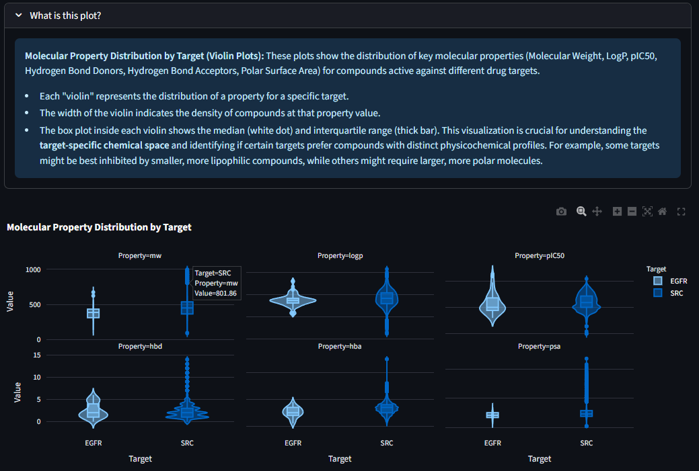
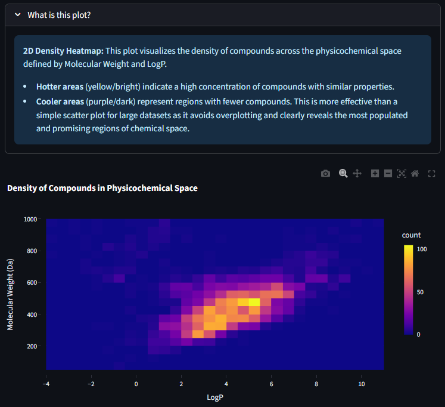

# 🔬 Interactive Drug Discovery Dashboard

[](https://www.python.org/)
[](https://streamlit.io/)
[](https://opensource.org/licenses/MIT)
[](https://www.ebi.ac.uk/chembl/)

> **A professional-grade biotech data analysis platform for pharmaceutical compound screening and structure-activity relationship (SAR) analysis.**

### 🎬 Interactive Demo


## 🌟 **[🚀 LIVE DEMO - Click Here!](https://drug-discovery-analyzer.streamlit.app/)**

*Try the interactive dashboard instantly - no installation required!*

---

## 🎯 Project Overview

This interactive web application bridges the gap between raw chemical data and actionable insights in drug discovery. Built for biotech professionals, it enables rapid analysis of compound libraries using industry-standard metrics and visualizations.

### Key Applications in Biotech
- **🎯 Hit Identification**: Screen thousands of compounds against activity and property criteria
- **🧬 Lead Optimization**: Analyze structure-activity relationships to guide medicinal chemistry
- **⚖️ Candidate De-risking**: Apply Lipinski's Rule of 5 and ADMET filters early in the pipeline
- **📊 Portfolio Analysis**: Compare compound properties across different therapeutic targets

---

## ✨ Features

- **Real-time Data Processing**: ChEMBL API integration for live pharmaceutical data
- **Interactive Filtering**: Multi-parameter compound filtering with instant updates  
- **Publication-Quality Visualizations**: Correlation heatmaps, density plots, and SAR analysis
- **Industry-Standard Metrics**: Lipinski Rule of 5, pIC50 calculations, drug-likeness scoring
- **Target-Specific Analysis**: Compare molecular properties across different protein targets
- **Professional UI**: Clean, biotech-focused interface with scientific explanations

---

## 🚀 Live Demo & Screenshots

### **[🌟 Try the Interactive Dashboard](https://drug-discovery-analyzer.streamlit.app/)**
*Click above for instant access - no installation required!*


*Main dashboard showing compound filtering and overview metrics*


### Interactive Visualizations

#### 1. Lipinski Plot (LogP vs Molecular Weight)


*Visualization of drug-like space with compounds colored by potency (pIC50). Shows the relationship between lipophilicity and molecular size, with Lipinski's Rule of 5 boundaries highlighted.*

#### 2. Triangular Correlation Heatmap  


*Triangular correlation matrix eliminating redundancy. Red indicates positive correlations, blue shows negative correlations. Essential for understanding relationships between molecular properties.*

#### 3. Property Distribution Analysis


*Histogram analysis showing the distribution of key molecular properties (MW, LogP, HBD, HBA, PSA, pIC50). Critical for understanding the chemical space coverage of compound libraries.*

#### 4. Drug-Likeness Comparison


*Box plot comparison of molecular properties between drug-like and non-drug-like compounds based on Lipinski's Rule of 5. Reveals property trends for developable compounds.*

#### 5. Target-Specific Chemical Space


*Violin plots showing how different protein targets prefer distinct molecular property profiles. Essential for target-focused library design.*

#### 6. 2D Density Analysis


*2D density visualization of compound distribution in physicochemical space. Bright areas indicate high compound density, revealing popular regions for drug development.*

---

## 🛠️ Installation & Usage

### Prerequisites
- Python 3.9 or higher
- pip package manager

### Quick Start
```bash
# Clone the repository
git clone https://github.com/Febo2788/drug-discovery-analyzer.git
cd drug-discovery-analyzer

# Install dependencies
pip install -r requirements.txt

# Launch the application
streamlit run app.py
```

The dashboard will open in your default web browser at `http://localhost:8501`

### Using Your Own Data
Upload a CSV file with the following required columns:
- `chembl_id`: Compound identifier
- `name`: Compound name
- `target`: Target protein name  
- `ic50`: IC50 values in nM
- `mw`: Molecular weight (Da)
- `logp`: LogP lipophilicity
- `hbd`: Hydrogen bond donors
- `hba`: Hydrogen bond acceptors
- `psa`: Polar surface area

---

## 🏗️ Technical Architecture

```
drug-discovery-analyzer/
├── app.py                          # Main Streamlit application
├── scripts/
│   ├── data_retrieval/
│   │   └── chembl_fetcher.py       # ChEMBL API integration
│   └── analysis/
│       └── molecular_analysis.py   # Core analysis functions
├── images_and_gif/                 # Documentation assets
├── requirements.txt                # Python dependencies
├── Dockerfile                     # Container deployment
└── tests/                         # Unit tests
```

### Key Technologies
- **Frontend**: Streamlit for interactive web interface
- **Data Processing**: Pandas, NumPy for efficient data manipulation  
- **Visualization**: Plotly for interactive plots, Matplotlib/Seaborn for static analysis
- **API Integration**: ChEMBL webservice client for pharmaceutical data
- **Deployment**: Docker containerization for reproducible environments

---

## 🧪 Scientific Methods

### Lipinski's Rule of 5
Evaluates oral bioavailability using four key criteria:
- Molecular Weight ≤ 500 Da
- LogP ≤ 5
- Hydrogen Bond Donors ≤ 5  
- Hydrogen Bond Acceptors ≤ 10

### pIC50 Calculations
Converts IC50 values to logarithmic scale for better visualization:
```
pIC50 = -log10(IC50 in M)
```

### Structure-Activity Relationships (SAR)
Analyzes correlations between molecular properties and biological activity to guide medicinal chemistry optimization.

---

## 🤝 Contributing

1. Fork the repository
2. Create a feature branch (`git checkout -b feature/amazing-feature`)
3. Commit your changes (`git commit -m 'Add amazing feature'`)
4. Push to the branch (`git push origin feature/amazing-feature`)
5. Open a Pull Request

---

## 📚 References

- ChEMBL Database: https://www.ebi.ac.uk/chembl/
- Lipinski, C.A. et al. Experimental and computational approaches to estimate solubility and permeability. *Adv. Drug Deliv. Rev.* (2001)
- Streamlit Documentation: https://docs.streamlit.io/

---

## 📄 License

This project is licensed under the MIT License - see the [LICENSE](LICENSE) file for details.

---

*Built for a friend. Thank you Stephanie for teaching me about how to present chemoinformmatics!!*
