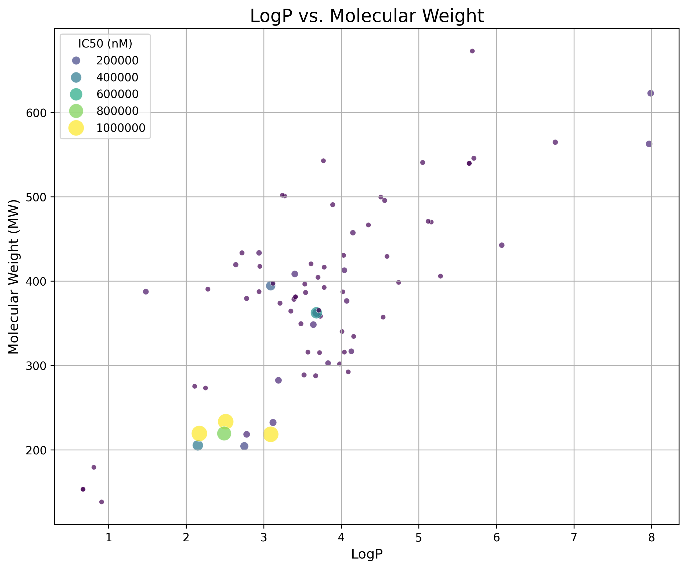
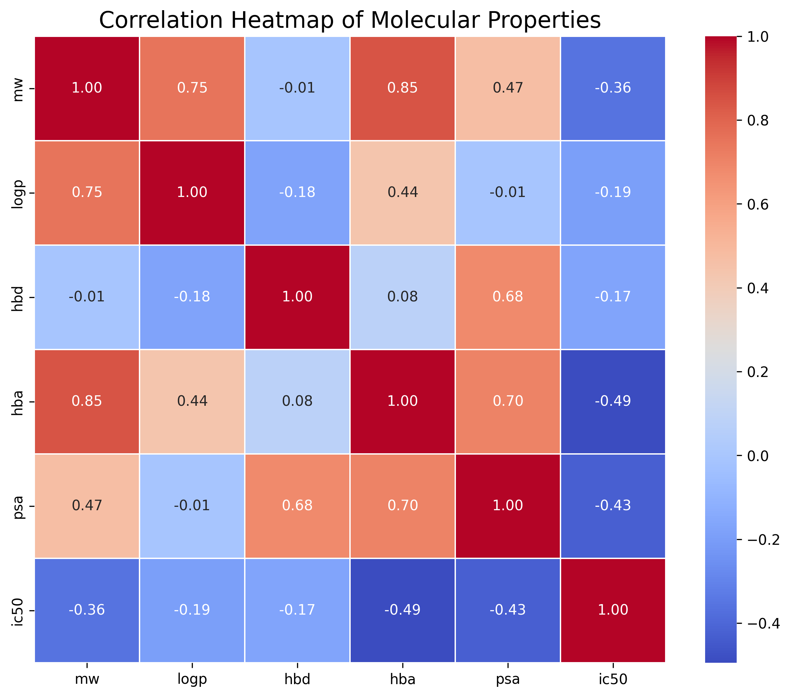
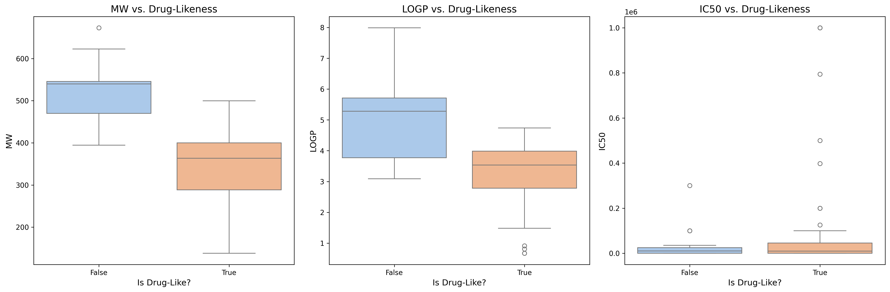

# 🔬 Interactive Drug Discovery Dashboard

[](https://www.python.org/)
[](https://streamlit.io/)
[](https://opensource.org/licenses/MIT)

---

## 🚀 Project Description

This interactive web application is a powerful tool for **early-stage drug discovery**, designed to bridge the gap between raw chemical data and actionable insights. In the fast-paced biotech industry, the ability to rapidly analyze, visualize, and filter large compound libraries is critical. This dashboard provides a user-friendly interface to perform key chemoinformatic analyses, accelerating the identification of promising drug candidates.

### Biotech Applications

-   **Hit Identification:** Quickly sift through thousands of compounds from high-throughput screens to identify potential 'hits' that meet specific physicochemical and activity criteria.
-   **Lead Optimization:** Interactively explore structure-activity relationships (SAR) by filtering on properties like IC50, LogP, and molecular weight to guide the chemical optimization of lead compounds.
-   **Candidate De-risking:** Proactively flag and filter out compounds with properties associated with poor pharmacokinetics or toxicity (e.g., violations of Lipinski's Rule of Five), saving valuable time and resources.

---

## 📸 Application Screenshots

*A live demo of the interactive dashboard in action. Users can upload data, apply filters, and explore the results in real-time.*

**[Placeholder for a GIF or screenshot of the app UI]**

### Key Visualizations

Below are examples of the interactive plots generated by the application, which allow for a deep dive into the dataset.

| LogP vs. Molecular Weight                                    | Property Distributions                                     |
| ------------------------------------------------------------ | ---------------------------------------------------------- |
|               |    |
| **Correlation Heatmap**                                      | **Drug-Likeness Comparison**                               |
|                  |            |

---

## 🛠️ Technical Deep Dive

The dashboard integrates several key chemoinformatic analyses:

-   **Lipinski's Rule of Five:** A rule of thumb to evaluate the 'drug-likeness' of a chemical compound. It predicts that a compound is more likely to have good oral bioavailability if it satisfies the following criteria:
    -   Molecular Weight (MW) ≤ 500 Daltons
    -   LogP (a measure of lipophilicity) ≤ 5
    -   Hydrogen Bond Donors (HBD) ≤ 5
    -   Hydrogen Bond Acceptors (HBA) ≤ 10
-   **IC50:** The half maximal inhibitory concentration, which represents the concentration of a drug that is required for 50% inhibition in vitro. It is a standard measure of a compound's potency.
-   **Molecular Properties (MW, LogP, HBD, HBA, PSA):** These physicochemical properties are critical determinants of a drug's absorption, distribution, metabolism, and excretion (ADME) profile.

---

## ⚙️ Installation & Usage

Follow these steps to set up and run the project locally.

### 1. Prerequisites

-   Python 3.9 or higher
-   `pip` package manager

### 2. Clone the Repository

```bash
git clone <your-repository-url>
cd <repository-directory>
```

### 3. Install Dependencies

All required packages are listed in the `requirements.txt` file. Install them with the following command:

```bash
pip install -r requirements.txt
```

### 4. Run the Application

Launch the Streamlit dashboard with this command:

```bash
streamlit run app.py
```

The application will open in your default web browser.

---

## 💡 Future Improvements

-   **Advanced Analytics:** Integrate more complex analyses like Quantitative Structure-Activity Relationship (QSAR) modeling or molecular docking scores.
-   **Database Integration:** Connect directly to live databases like ChEMBL or PubChem for real-time data fetching.
-   **User Accounts:** Implement user authentication to allow for saving and managing private datasets and analyses.
-   **Expanded Filtering:** Add filters for substructure matching or similarity to a reference compound.

---

## 🏆 Skills Demonstrated

-   **Programming:** Python
-   **Web Development:** Streamlit
-   **Data Analysis & Visualization:** Pandas, NumPy, Plotly, Seaborn, Matplotlib
-   **Scientific Computing:** Chemoinformatics, Drug Discovery Principles
-   **Software Engineering:** Modular Code, Dependency Management (`requirements.txt`), Version Control (Git)